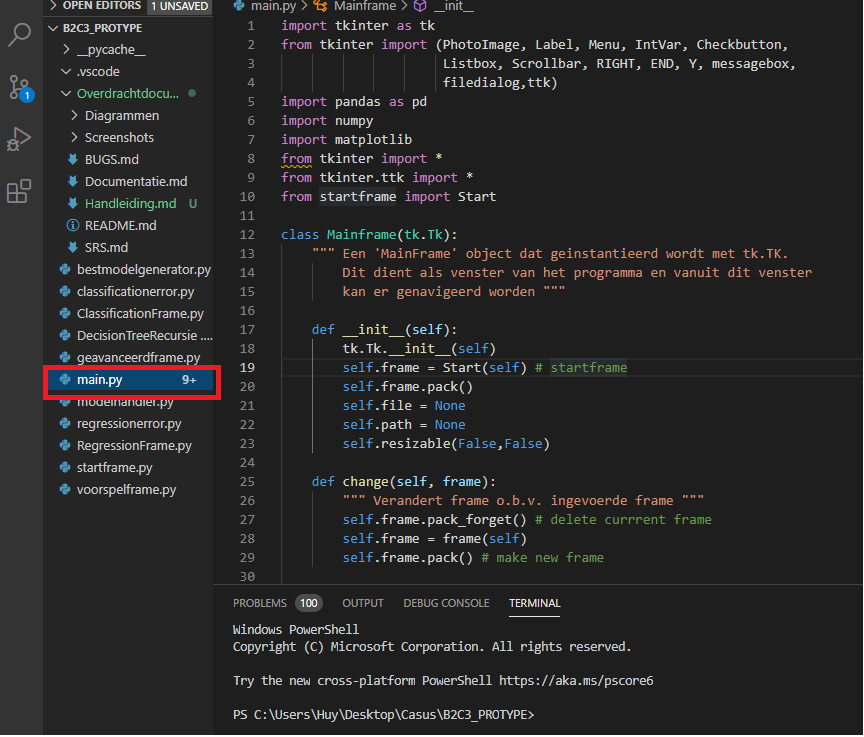

# Handleiding

## Stap 1 Run Main.py

## Stap 2 Selecteer een bestand (xlsx,csv)

## Stap 3 Laad het geselecteerde bestand in

## Stap 4 Selecteer classification of regression

## Stap 5 Kies de afhankelijke en onafhankelijke variabelen

## Stap 6 Druk op Train en voer een voorspelling uit

## Stap 7(Optioneel) Bekijk alternatieven beste gegeneerde modellen

## Stap 8(Optioneel) Pas de parameters aan
